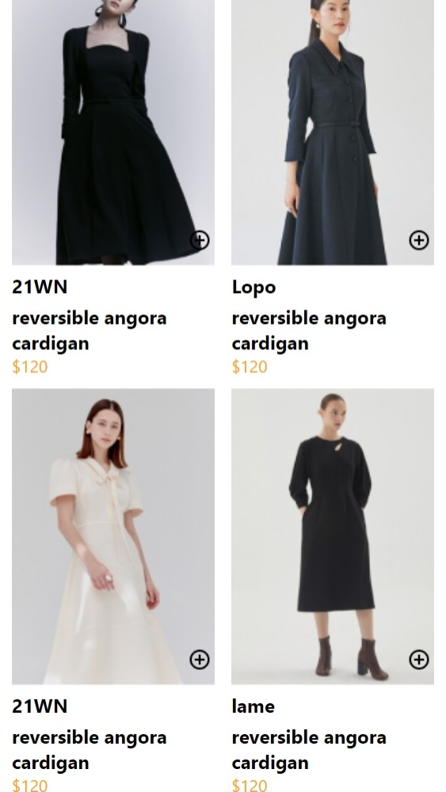
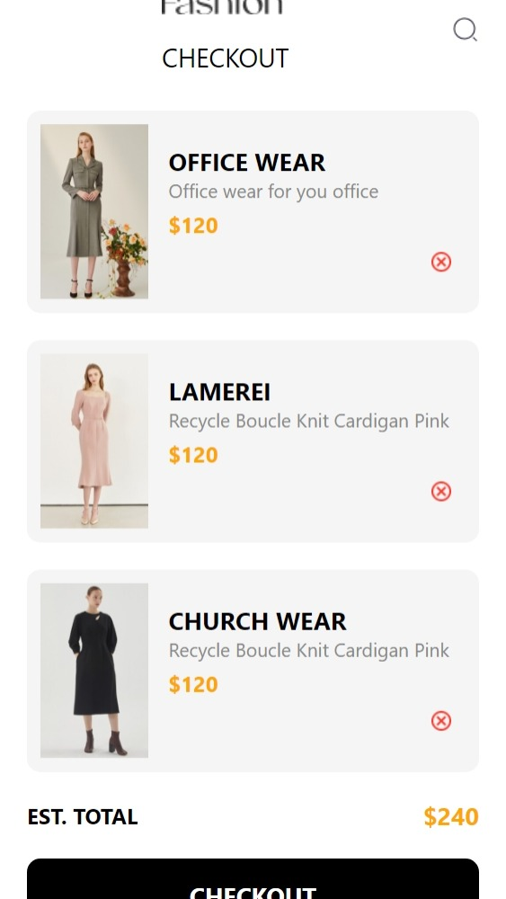

# rn-assignment6-11352339

# README

## E-Commerce App
I made this e-commerce app for my React Native project. It's pretty basic, but it works!

## What it does

The app has two screens: HomeScreen and CartScreen. On the HomeScreen, you can see a list of products with pictures and prices. You can add them to your cart by clicking the "Add to Cart" button. Then, on the CartScreen, you can see all the products you've added to your cart and remove them if you want.

## How I did it

I used React Native to build the app, and I stored the cart data locally on the device using AsyncStorage. I also used FlatList to display the products and cart items.

## Files

CartScreen.js: This is the screen where you can see the products in your cart.
App.js: This is the main app component that renders the CartScreen.
How to run it

To run the app, just clone the repository and install the dependencies using npm install or yarn install. Then, run the app using npx react-native run-ios or npx react-native run-android.

# Screenshots

